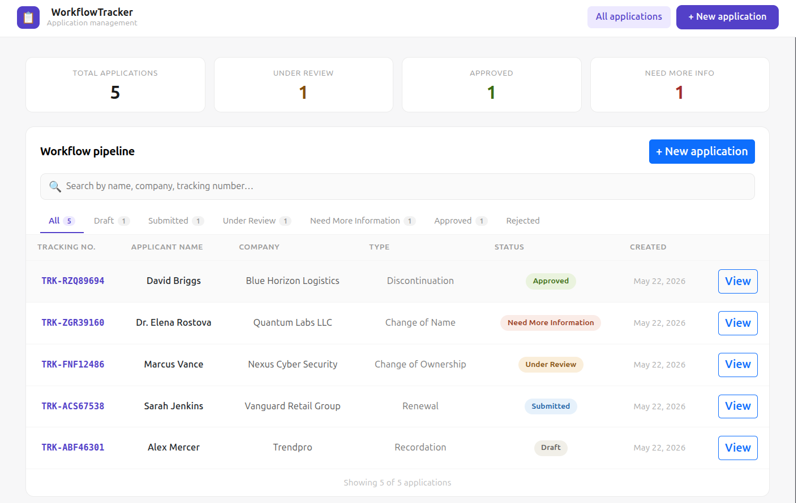
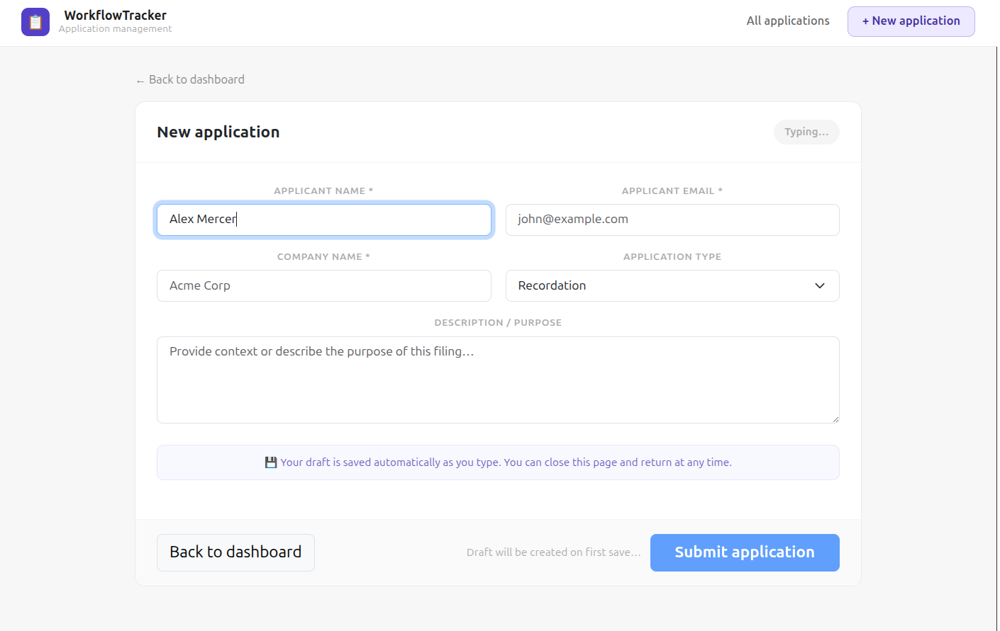
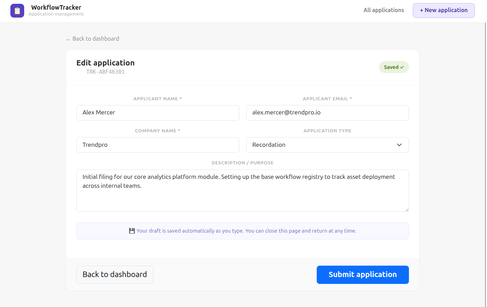
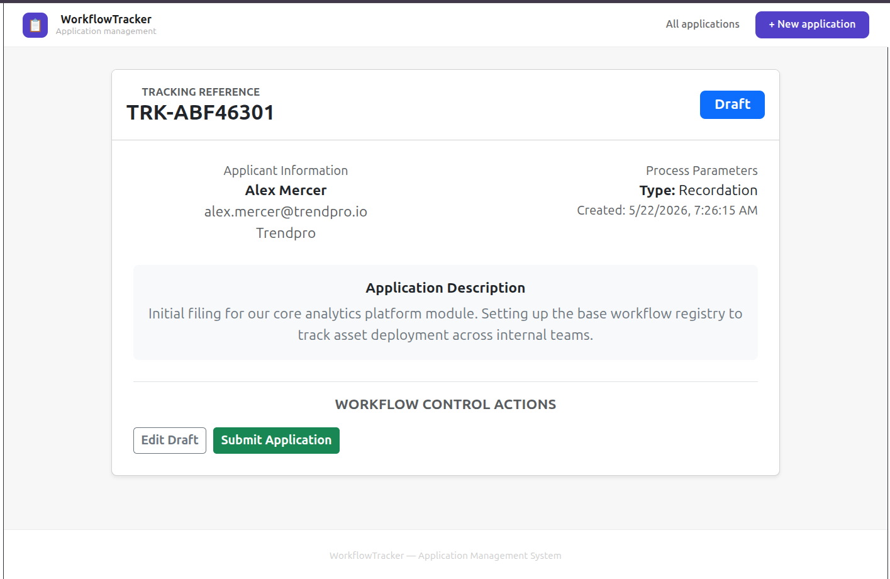
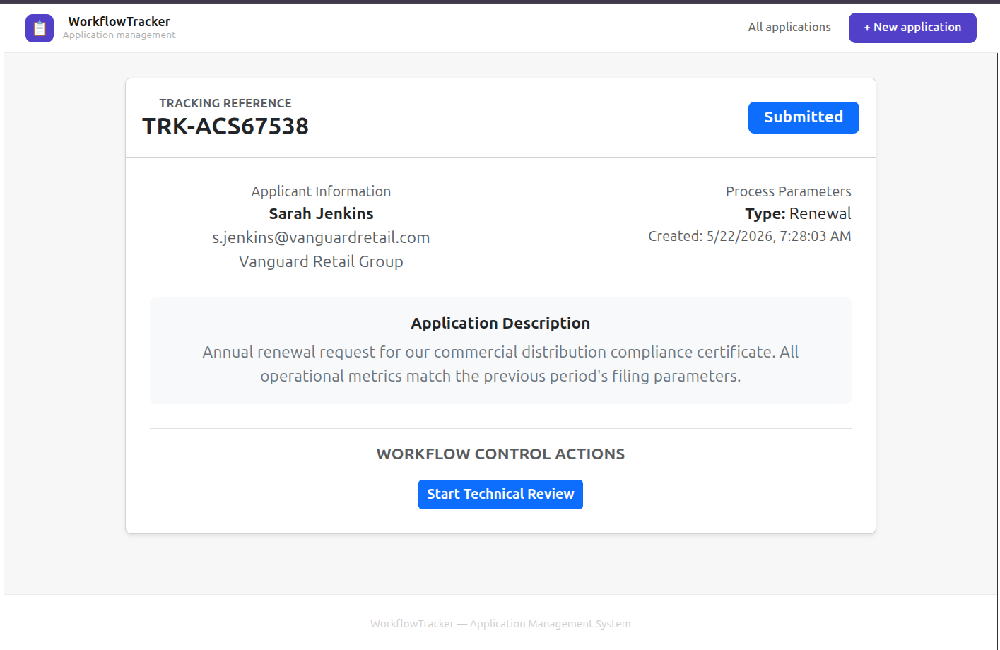
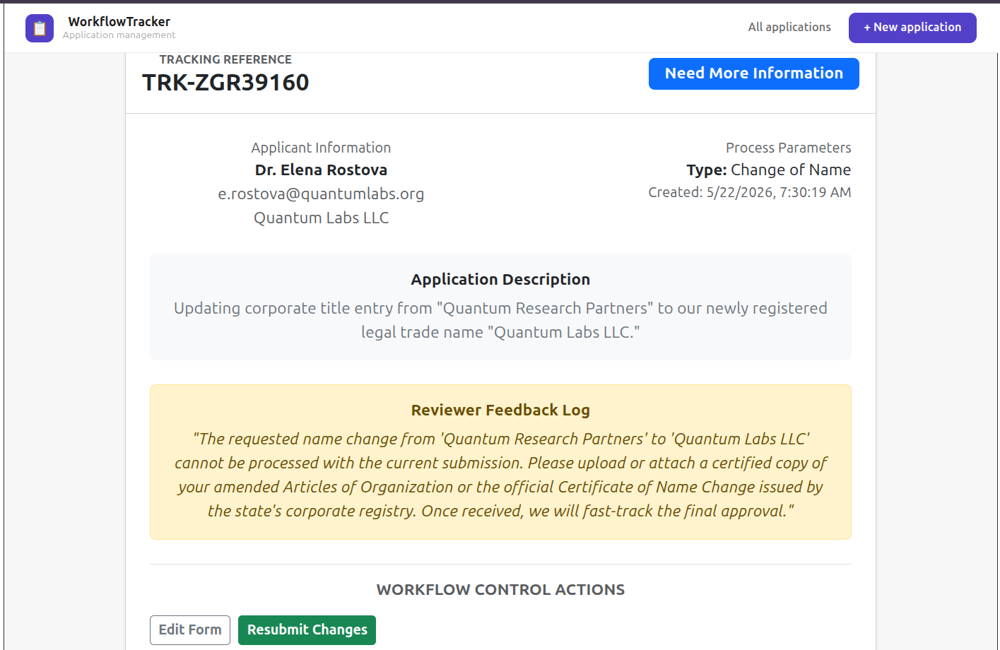
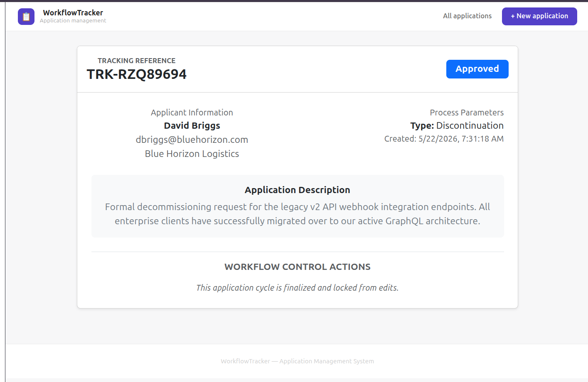
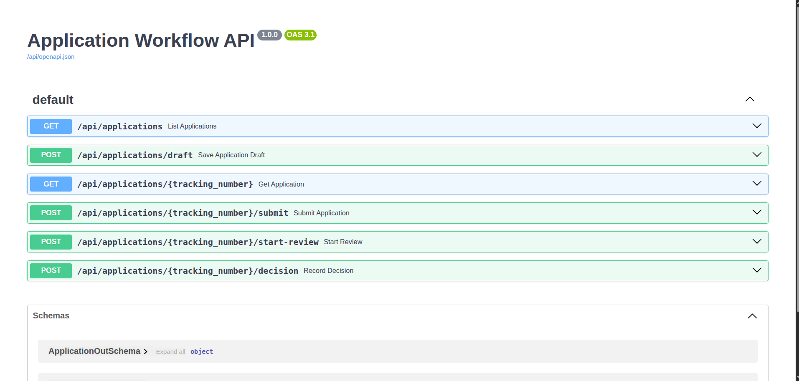

# Workflow Tracker

This is a small application workflow tracker built with a Django backend and a React frontend.

## Why I Chose This Setup

I went with a **completely decoupled client/server setup** (Vite/React on the frontend, Django on the backend) because it makes the separation of concerns perfectly clean. The backend acts as a strict API and state machine, while the frontend handles the UI. It also provides a much faster local developer experience using Vite’s dev server instead of trying to funnel built static assets through Django templates during development.

### The Auto-Save Feature

Instead of just making a standard form with a basic submit button, I implemented an **automatic background draft saver**.

* When a user opens a new form and starts typing, the app waits for a 1.5-second pause in typing (using a custom debounce hook) and automatically fires a request to save the data as a Draft.
* If it's a brand new application, the backend generates a unique tracking number, sends it back, and the React frontend updates the browser URL from /new to /edit/TRK-XXXXX seamlessly. If the user refreshes, they don't lose their place.

*Note: I used **Django Ninja** as requested. It uses Python type hints and Pydantic schemas, which automatically generated interactive documentation for the API at /api/docs.*

----

## Project Structure

```
project-root/
├── backend/
│   ├── core/
│   │   ├── models.py        # Application model
│   │   ├── schemas.py       # Ninja input/output schemas
│   │   ├── api.py           # All API endpoints
│   │   └── migrations/
│   ├── config/
│   │   ├── settings.py
│   │   └── urls.py
│   ├── manage.py
    └── requirements.txt
├── frontend/
│   ├── src/
│   │   ├── pages/
│   │   │   ├── ApplicationList.jsx    # Dashboard with stats + search
│   │   │   ├── ApplicationForm.jsx    # Create/edit with autosave
│   │   │   └── ApplicationDetail.jsx  # Detail view + workflow actions
│   │   └── App.jsx
│   └── package.json
├── manage.py
├──README.md
└──.gitignore
```

---

How to Get It Running
---


### Prerequisites

- Python 3.10+
- Node.js 18+
- pip


### 1. Backend Setup

1. Open your terminal and go into the backend folder:
```bash
cd backend


```
2. Create and turn on your virtual environment:
   ```bash
   python3 -m venv .venv
   
   # Windows:
   .venv\Scripts\activate
   # Mac/Linux:
   source .venv/bin/activate


3. Install the packages:
```bash
 pip install -r requirements.txt 


```
4. Run migrations to create the database:
   ```bash
   python manage.py makemigrations
   python manage.py migrate
   

5. Start the server:
```bash
python manage.py runserver


```
The API will be live at http://localhost:8000. You can see and test all the endpoints interactively at http://localhost:8000/api/docs.

---

## API Endpoints

| Method | Endpoint | Description |
|---|---|---|
| `GET` | `/api/applications` | List all applications |
| `GET` | `/api/applications/{tracking_number}` | Get application details |
| `POST` | `/api/applications/draft` | Create or update a draft (autosave upsert) |
| `POST` | `/api/applications/{tracking_number}/submit` | Submit a draft |
| `POST` | `/api/applications/{tracking_number}/start-review` | Move to Under Review |
| `POST` | `/api/applications/{tracking_number}/decision` | Record reviewer decision |

---


### 2. Frontend Setup

1. Open a new terminal tab and go to the frontend folder:
   ```bash
   cd frontend
2. Install the node modules:
```bash
npm install


```
3. Run the development server:
   ```bash
   npm run dev

Open http://localhost:5173 in your browser to view the app.

---

## My Assumptions

* **Public Access for Now:** I didn't add login or user authentication. Anyone can access the dashboard and move applications through the steps. In a production app, I would restrict the review/decision actions strictly to reviewer accounts.
* **Auto-Save vs. Submission:** Auto-saving only updates fields in a Draft or Need More Information state. A user still has to explicitly click "Submit Application" to push it forward into the Submitted state for review.
* **Tracking Numbers:** I chose to generate random tracking numbers (TRK- followed by letters and numbers) on the backend using the model's save() method. This ensures they are always unique and handled by the database safely.

---

## What I Would Improve With More Time

Because of the 3-5 hour time limit, I focused entirely on making sure the core workflow state machine was bulletproof and the UI looked clean using Bootstrap. If I had more time, I would add:

1. **User Authentication & Roles:** Add JWT or session tokens so that applicants can only see/edit their own drafts, and only authorized staff can see the "Start Review", "Approve", or "Reject" buttons.
2. **Database Transactions:** Wrap the workflow state changes in Django's atomic transactions so that if a step fails halfway through, the database rolls back to safety automatically.
3. **Better Error Messages:** Show prettier user-facing notifications if a network request fails, rather than generic browser alerts.
4. **Unit Tests:** Write backend test cases in Django to thoroughly check that an application can't bypass workflow rules (like trying to approve a draft without it being reviewed first).

## 📸 Interface Preview
Here is a visual walkthrough of the system running through the required state machine transitions.

### 📊 Main Pipeline Dashboard
Shows all active entries across different companies, with status badge filtering.


### ✍️ Creation & The Auto-Save Feature
The dynamic row-by-row layout saving a fresh application draft in the background.
* **Empty State:** 
* **Debounced Auto-Saving Indicator:** 

### 🔄 State Machine & Detail Views
The action panel dynamically adjusts options based on the entry's exact database status:
* **Draft Saved State:** 
* **Submitted State (Awaiting Review):** 
* **Need More Information State (With Reviewer Feedback Log):** 
* **Approved State (Finalized & Locked):** 

### 🔌 Automated API Documentation
The built-in Swagger/OpenAPI interactive interface generated automatically by Django Ninja.
